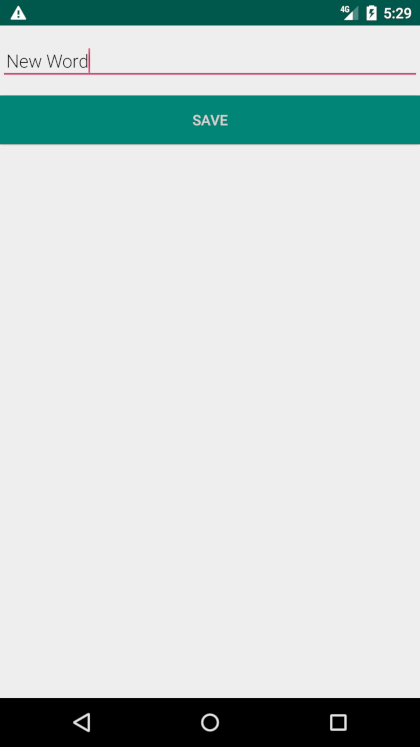

# Android Jetpack Room with a View Codelab

Android Codelab finished code in Kotlin codebase + Coroutines
See [This Google Codelab](https://codelabs.developers.google.com/codelabs/android-room-with-a-view-kotlin/#0) For Details

### Android Jetpack components used

- [Room](https://developer.android.com/topic/libraries/architecture/room)
- [LiveData](https://developer.android.com/topic/libraries/architecture/livedata)
- [ViewModels](https://developer.android.com/topic/libraries/architecture/viewmodel)
- [AndroidX](https://developer.android.com/jetpack/androidx)

### Other
- [Coroutines](https://kotlinlang.org/docs/reference/coroutines-overview.html)

# Screenshots

